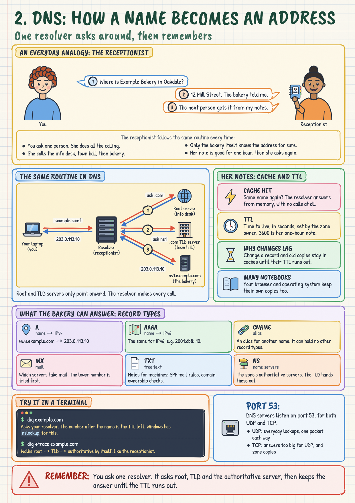
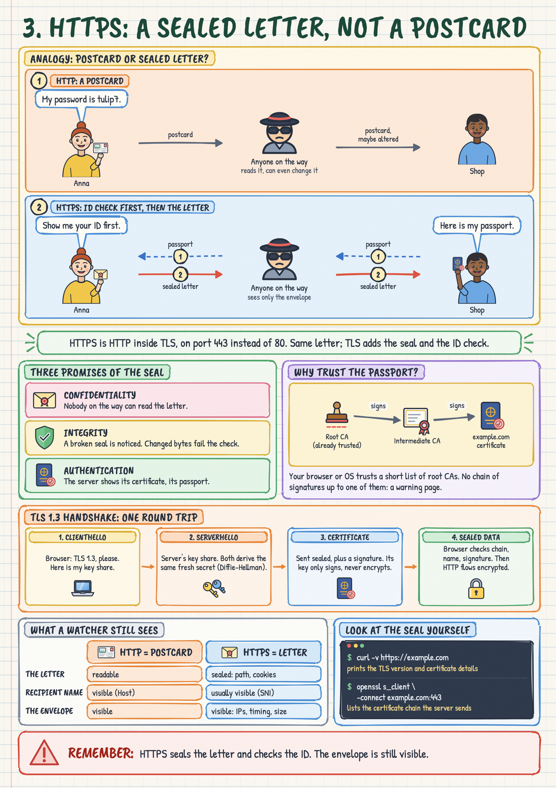
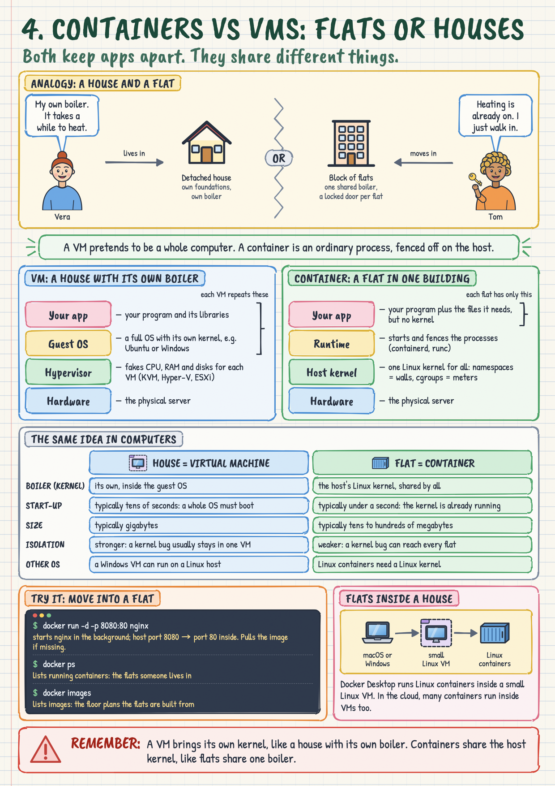
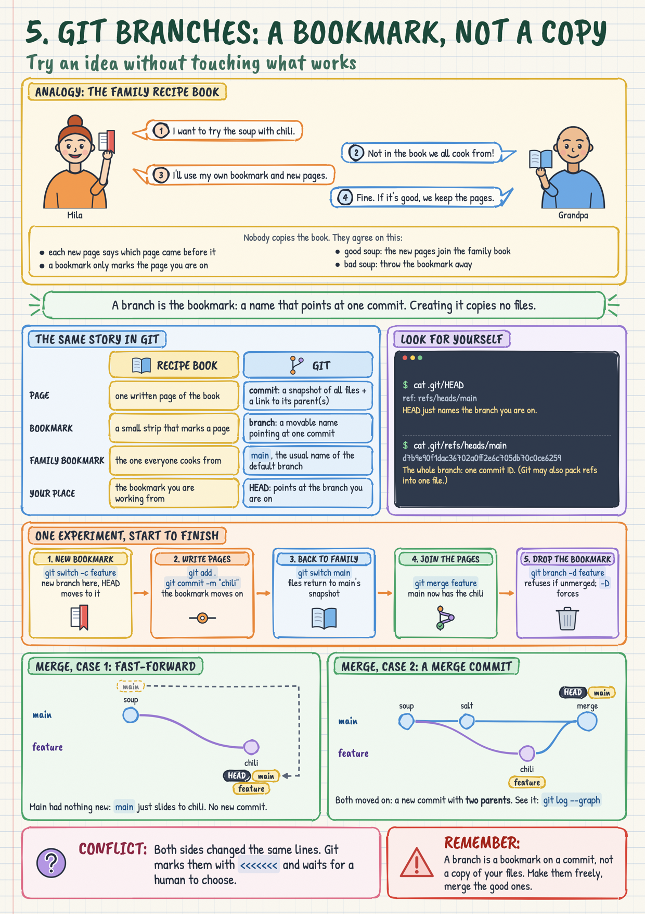
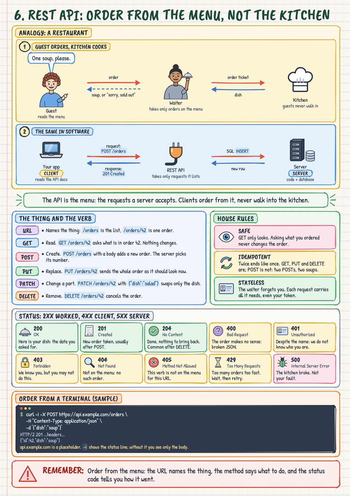
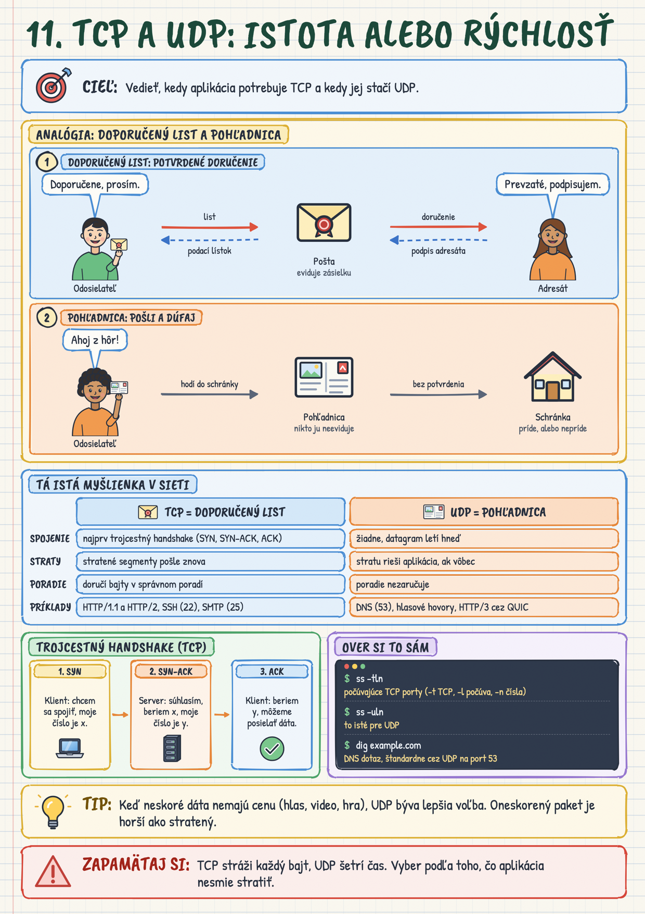
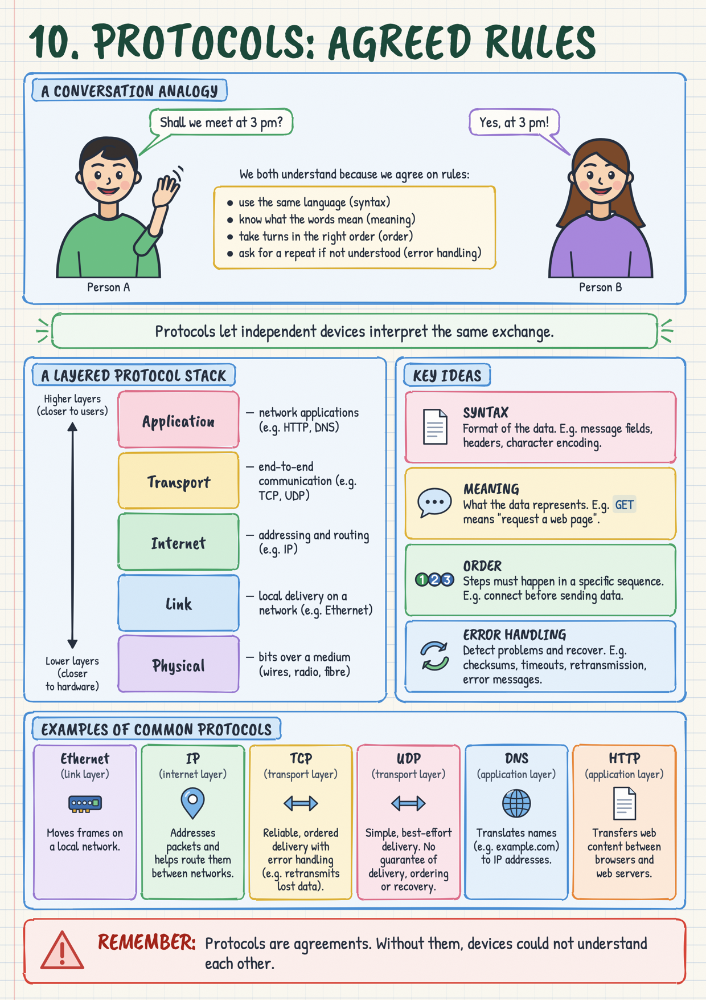
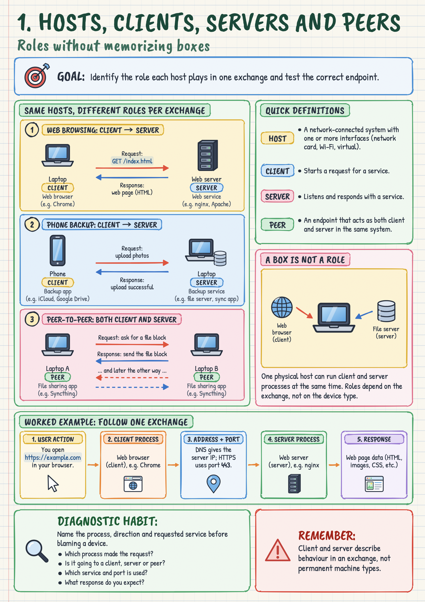
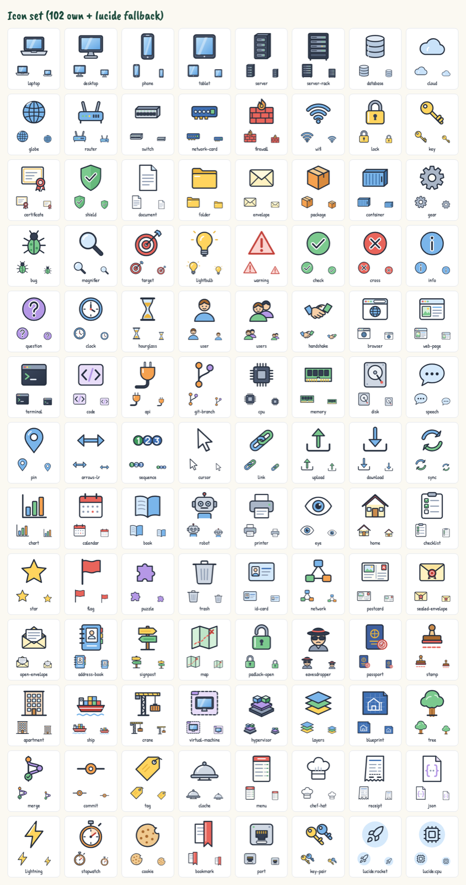

# Infographic kit

Turns a content-only JSON spec into a one-page "sketchnote" study sheet (hand-drawn ink
outlines, pastel boxes, handwriting fonts, small coloured illustrations) as PNG, PDF and
HTML. Style lives in the engine, content lives in the spec, so every page looks like it
belongs to the same set. Same spec in, same pixels out (seeded, verified by checksum).

No image model and no external API: a coding agent (or a person) writes the spec, the
engine draws the page with code.

## Gallery

| | | |
|---|---|---|
| [](gallery/02-dns.pdf) | [](gallery/03-https-tls.pdf) | [](gallery/04-containers-vs-vms.pdf) |
| [](gallery/05-git-branches.pdf) | [](gallery/06-rest-api.pdf) | [](gallery/01-tcp-udp-sk.pdf) |
| [](gallery/00-protocols.pdf) | [](gallery/00-hosts-clients.pdf) | [](gallery/_icons.png) |

Click a page for the PDF (A4, selectable text). The previews are half-size; a render
writes full-size files to `out/`.

## How this was made

The kit and all pages were produced with Claude Code in one working session: one model
planned and reviewed every render, one agent built the engine over four rounds, one
agent per page wrote the specs, and a separate agent fact-checked the texts. The pages
are AI-generated study material: check facts before relying on them
(`review/factcheck-round1.md` lists what the review covered and what it did not).

- [POSTUP.md](POSTUP.md): the method and lessons, in Slovak.
- [BRIEF.md](BRIEF.md): the original architecture brief.

## Install

Needs Node.js 20+ and Google Chrome (no Chromium download, no network at render time).
The default Chrome location is the macOS one, `/Applications/Google Chrome.app`. On
Windows or Linux, set `CHROME_PATH` to your Chrome or Chromium executable. The kit was
built and tested on macOS only.

```
git clone https://github.com/robertbarcik/infographic-kit.git
cd infographic-kit
npm install
npm run render:all
```

## Render

```
node engine/render.mjs specs/00-protocols.json   # one page
node engine/render.mjs --all                     # every spec in specs/ (except _*.json)
```

Writes `out/<name>.png` (2480x3508), `out/<name>.pdf` (A4, one page, selectable text),
`out/<name>.html` and `out/<name>.report.json`. A non-zero exit code means the page failed
the validator; the messages name the row, section, component and field. Always look at
the PNG.

## Writing a page

Read **[AUTHORING.md](AUTHORING.md)**: schema, components, text budgets, icons, roles,
people, validator messages and content rules. It is generated from the engine
(`node engine/list.mjs --authoring`), so it is always in step with the code.
`node engine/list.mjs` prints the same reference in the terminal.

## Layout of the kit

```
engine/render.mjs          CLI: validate spec, render, measure, write outputs
engine/list.mjs            prints components/icons/roles/budgets; --authoring regenerates AUTHORING.md
engine/sheets.mjs          contact sheets out/_icons.png and out/_characters.png
engine/components/*.mjs    one file per component (fields + budgets + example + render)
engine/icons/icons.mjs     the icon set (64x64 SVG, one visual language) + aliases
engine/characters/         the parametrised person
engine/styles/             tokens.css (all colours/fonts/sizes), page.css, components.css
engine/client/page.js      in-page runtime: auto-fit, rough.js drawing, layout checks
engine/lib/                schema DSL, spec validator, template, markup, browser
engine/tools/              selftest (validator regression), crop, pixdiff, probe, sidebyside
engine/fonts/              Caveat Brush + Patrick Hand (OFL), Latin + Latin Extended
specs/                     page specs (content only)
gallery/                   committed previews (half-size PNG) and PDFs of every page
out/                       render output (ignored by git)
```

## Adding an icon

1. Add an entry to `ICONS` in `engine/icons/icons.mjs`: `name: { tags, svg }`. Draw in a
   64x64 box inside the shared ink group (stroke 2.4, round caps); fill with the palette
   `C.*` only; use the helpers (`tube`, `glare`, `dot`, `line`, `arcArrow`) to stay in style.
   Alternative names go in `ICON_ALIASES`.
2. `node engine/sheets.mjs icons`, open `out/_icons.png`, check it at all three sizes
   next to its neighbours; redraw until it belongs to the family.
3. `node engine/list.mjs --authoring` to publish it in the guide.

## Adding or changing a component

1. Create `engine/components/<name>.mjs` exporting `{ name, summary, labelRequired, fields,
   defaultRole, check?, example, render(sec, ctx) }`. Declare every field with the schema DSL
   (`text(max)`, `list(...)`, `icon()`, ...) so budgets and validation come for free.
   Produce text only via `ctx.t(...)` (measurable), icons via `ctx.icon`, people via
   `ctx.person`; mark drawn boxes with `data-rough="box|card|soft|panel|tab|pill|circle|bubble|arrow"`
   and measured containers with `data-box`.
2. Register it in `engine/components/index.mjs`; add layout CSS in `styles/components.css`
   (sizes in rem, never colours: those come from the role variables).
3. Render a test spec, inspect the PNG (crop with `engine/tools/crop.mjs`), run
   `node engine/tools/selftest.mjs`, regenerate AUTHORING.md.

Rule: if a page needs something the engine cannot do, extend the engine for all pages;
never hand-tune one page or put styling into a spec.
